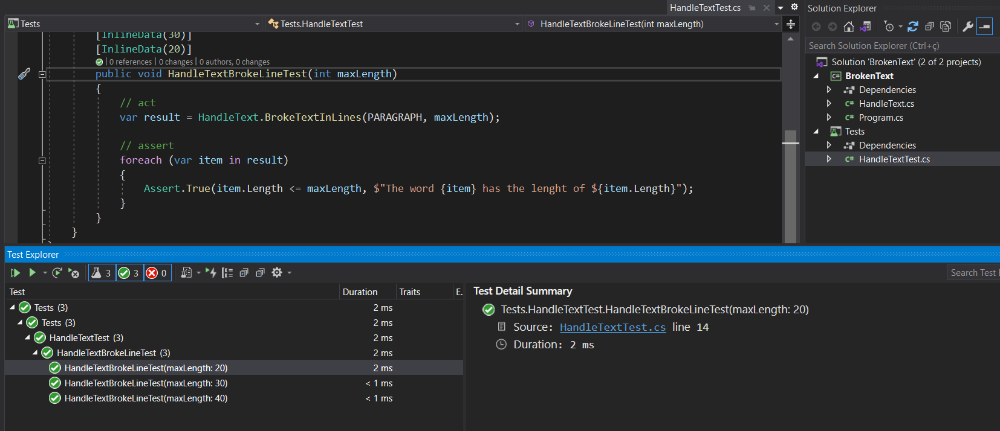
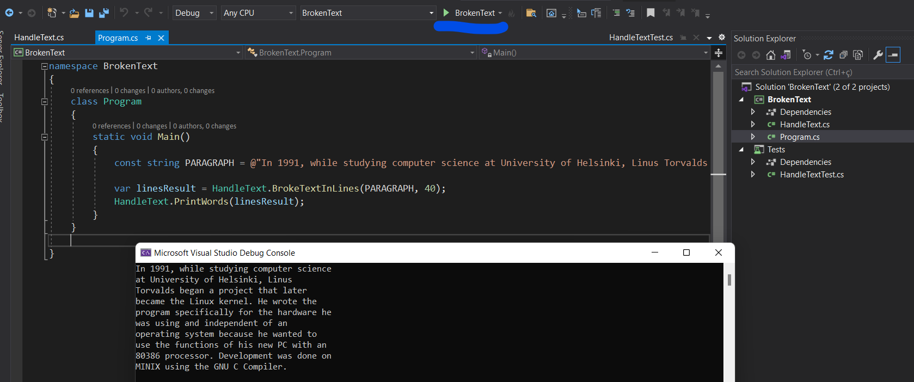

# Broken Text
An console application using C# with .NET core 3.1

## The problem to solve

Implement a function that receives:

- any text
- a character limit per line

And be able to generate a new text broken into lines with a maximum limit of characters per line defined. 
Important note: **No words can be broken**.

**Input text example:**

"In 1991, while studying computer science at University of Helsinki, Linus Torvalds began a project that later became the Linux kernel. He wrote the program specifically for the hardware he was using and independent of an operating system because he wanted to use the functions of his new PC with an 80386 processor. Development was done on MINIX using the GNU C Compiler."

**Example output 40 character:**

In 1991, while studying computer science
at University of Helsinki, Linus
Torvalds began a project that later
became the Linux kernel. He wrote the
program specifically for the hardware he
was using and independent of an
operating system because he wanted to
use the functions of his new PC with an
80386 processor. Development was done on
MINIX using the GNU C Compiler.

## Tests

## Reference

[Chalenge](https://github.com/VigilTech/backend-challenge)